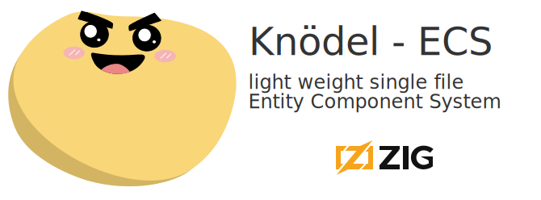

# Knödel-ECS

Single file data oriented application framework written in Zig.

Heavily inspired by my favorite rust ECS `Bevy`.

Works great with any backend. Raylib, Sokol or your own



**zig version: 0.15.1**

## Features

- Intuitive plugin API.
- Lock free auto concurrency.
- Resources and system locals.
- Archtype based storage.
- Component hooks.
- Single file. Easy to copy, modify and own.
- Event and state extensions.

Example:

## How to run

```zig
pub const kn = @import("knoedel").Knoedel(.{
    .thread_count = 8,
    .max_frame_mem: usize = 128 * MB,
});

const Schedule = enum{
    init,
    pre_update,
    update,
    post_update,
    pre_render,
    render,
    cleanup,
};

pub fn main()!void{

    var app : kn.App = undefined;
    try app.init(std.heap.c_allocator);
    defer app.deinit();

    // add your plugins
    try app.addPlugin(@import("game_start.zig"));
    // ...

    // run the init schedule once
    try app.run(Schedule.init, true); // <-- `true`: consume command buffer after schedule

    while(true){
        app.runPar(Schedule.pre_update, true);
        app.runPar(Schedule.update, true);
        app.runPar(Schedule.post_update, true);
        app.runPar(Schedule.pre_render, true);
        app.run(Schedule.render, false);
        app.runPar(pre.Schedule.cleanup, true);
        app.update(); // reset frame arena, consume remaining commands, progress world ticks.
    }
}
```

## Plugin example

All mentioned components are not part of Knödel. Only `Parent` and `Children` are provided.

```zig
// game_start.zig file
comst m = @import("main.zig");
const kn = m.kn;
const Schedule = m.Schedule;
const Gamestate = m.Gamestate;
// ...


pub fn plugin(world: *kn.App) !void {
    // conditional systems. Conditions just functions, you can write your own!
    // there is kn.And(a,b) and kn.Or(a,b) for more complex conditionals.
    try world.addSystemEx(Schedule.update, &spawn_player, kn.OnEnter(Gamestate.prepare));
    // chaining systems will respect order, even on concurrent schedules
    try world.addSystem(Schedule.update, kn.Chain(.{&prepare, &aim, &move}));
}

// A system can have unlimited args. All must implement `fromWorld(world: *kn.App)`.
// to harden any arg for lock free concurrency, look at the `addAccess` func on `ResMut` for example.
fn spawn_player(
    // any mutation of the world goes through commands. Also provided `walloc` (World Allocator) and `falloc` (Frame Allocator). These are arenas with the appropriate lifetime.
    cmd: kn.Commands,
    // Mutable Resource, just like in Bevy, `Res(type)` for read access only.
    game_state: kn.ResMut(kn.State(Gamestate)),
    // Queries can have multiple filters. `With(type)`, `WithOut(type)`, `Added(type)` and `Changed(type)` provided by core
    query: QueryFiltered(.{kn.Mut(Enemy), SomeComp}, .{kn.Added(Idle)}),
    // system local resources.
    counter: kn.Local(usize),
    // event writer and reader, just like in Bevy
) !void{
    // spawn player
    const player_entity = try cmd.spawn({
        Transform{},
        PlayerControlled{},
        Sprite.load("player.png"),
        .{ // tuples = spawn new entity as child
            Transform{},
            Sprite.load("gun.png"),
        }
    });

    // mutate some system local state.
    counter.inner += 1;

    // add player as target for all enemies
    var it = query.iterQ(struct {entity: kn.Entity, enemy: *Enemy, somecomp: *const SomeComp});
    while(it.next()) |entry|{
        entry.enemy.target = player_entity;
        std.debug.print("updated entity {d}\n", .{entry.entity.id()});
    }

    // enter next state
    try game_state.inner.set(Gamestate.ingame);

    // allocate in the current frame arena, don't bother with deallocation.
    // great for extracting and prepping render data for the current frame.
    _ = try cmd.falloc.alloc(u8, 1000);
}
```

## System Conditions and Queries

Any function with this signature can be a system filter:
`*const fn (*World, *LocalRegistry) !bool`
Any struct that implements these functions can be system parameter:
`pub fn fromWorld(world: *World) !Self` or `pub fn fromWorld(world: *World, locals: *ResourceRegistry) !Self`
To mark mutable access in a parallel world and let the system scheduler resolve it for your, implement this:
`pub fn addAccess(access: *Access) void`
Take a look at `ResMut` or any other baseline arg for further information.

```zig
// example: System on a timer using locals
pub fn OnTimer(comptime delta: f32) kn.App.SystemRegistry.ConditionFn {
    return (struct {
        fn on_timer(world: *kn.App, locals: *kn.ResouceRegistry) !bool {
            // `SystemTimer` is a simple state struct with `tick` func
            var timer = locals.get(SystemTimer) orelse blk: {
                try locals.register(world.memtator.world(), SystemTimer{
                    .duration = delta,
                });

                break :blk locals.get(SystemTimer).?;
            };
            const time = try world.resource(Time);
            if (timer.tick(time.delta)) return true;
            return false;
        }
    }).on_timer;
}

pub fn plugin(world: *kn.App) !void {
    // `And`, `Or` are also just functions taking 2 other functions following the signature
    try app.addSystemEx(Schedule.update, &my_system, kn.And(kn.InState(Gamestate.menu), OnTimer(1/60)));
    // use tuples to register multiple systems at once
    try app.addSystem(Schedule.update, .{&asys, &bsys, &csys});
    // chains respect order, tuples in chance run in parallel
    try app.addSystem(Schedule.update, kn.Chain{&asys, .{&b1sys, &b2sys}, &csys});
}

// Here are all filters available in one query.
// !IMPORTANT! `Changed` only works when you mark components as changed. In Zig we can't simple have deref traits implement side effects (syntax would be annoying)
// this can be done on the current iteration
fn my_system(
    query: kn.QueryFiltered(.{kn.Mut(Transform), Sprite}, .{Changed(Transform), With(Sprite), Without(Hidden), Added(GlobalTransform)}),
    time: kn.Res(Time),
    some_mut_res: kn.ResMut(Something),
)!void{
    // access a resource inner
    std.debug.print("dt: {d}\n", .{time.inner.delta});
    // mutate a resource
    some_mut_res.inner.something = 42;

    // entity can always accessed
    // non `const` pointers must be marked with `Mut()` else compiler error
    var it = query.iterQ(struct {
        entity: kn.Entity,
        transform: *Transform,
        sprite: *const Sprite,
    });

    while(it.next()) |entry|{

        // you need to manually mark a component as changed in the current iteration
        it.changed(Transform)
    }
    ...
}
```

## State Extension

State management with system conditions

```zig
const Gamestate = enum {
    loading,
    menu,
    game,
};

pub fn plugin(world: *kn.App) !void {
    // add your sate with the default and schedules where cleanup happens
    try app.addPlugin(kn.StatePlugin(Gamestate.loading, Schedule.cleanup));
    // States over multiple system conditions `OnEnter` `OnExit` and `InState`.
    try app.addSystemEx(Schedule.update, &my_system, OnEnter(Gamestate.menu));
}

pub fn my_system(
    cmd: kn.Commands,
) !void{

    _ = try cmd.spawn(.{
        // auto cleanup entities on state exit
        kn.StateScoped(Gamestate){.state = menu},
        ..
    });

}
```

## Event Extension

Event Reader and Writer, just like in bevy!
(currently events only live for 1 frame. The reader processes events of the last frame)

```zig
pub const MyEvent = struct{
    target: kn.Entity,
    somevalue: f32,
};

pub fn plugin(world: *kn.App) !void {
    // add the event plugin with a schedule on which events are processed
    try app.addPlugin(kn.EventPlugin(MyEvent, Schedule.cleanup));
}


// send a event
pub fn send_event_system(
    writer: kn.EventWriter(MyEvent),
) !void{
    try writer.send(MyEvent{
        .target = .placeholder,
        .somevalue = 420,
    });
}

// read events, each `EventReader` holds it's read state in the system locals
// so you can have and consume the same event on multiple systems.
pub fn read_event_system(
    reader: kn.EventReader(MyEvent),
) !void{
    for (reader.queue) |event|{
        ...
    }
}
```

## Jobs system

Job pool Arg does what it sounds like. A simple pool to further
balance load on your available threads.

```zig
pub fn propagate_global_transform(
    jobs: kn.Jobs,
    roots: kn.QueryFiltered(.{Transform}, .{kn.WithOut(kn.Parent)}),
    query: kn.Query(.{ Transform, kn.Mut(GlobalTransform), ?kn.Children }),
) !void{
    var it = roots.iterEntity();
    var wg = std.Thread.WorkGroup{};
    while(it.next()) |entity| try jobs.go(&wg, propgate_tree, .{entity, query});
    wg.wait();
}
// (this is just an example, in a real app, you should batch work)
```

## Component Hooks

Attach logic to component events. Perfect for hooking up external libs for example: Box2D physics.
Hooks run in the command flushing process, meaning they run in sync. Keep it simple, don't
add heavy logic.

```zig
pub fn plugin(world: *kn.App) !void {
    try world.addOnAddHook(Body, &body_add_hook);
    try world.addOnRemoveHook(Body, &body_remove_hook);
    try world.addOnDespawnHook(Body, &body_remove_hook);
}

// all hooks share the same function signature.
fn body_remove_hook(comp: *Body, _: kn.Entity, _: *kn.App) !void {
    if (comp.body_id) |id| box2d.b2DestroyBody(id);
}

// you can mutate added components
fn body_add_hook(comp: *Body, _: kn.Entity, world: *kn.App) !void {
    const phys = try world.getResource(Physics);
    comp.body_id = b2CreateBody(phys.world_id, &comp.body_def)
}

```
